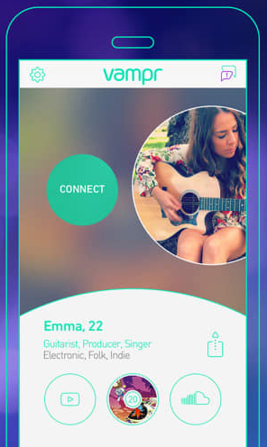

# **Ivan Zezyulya**
  

### **iOS Developer**
_Omsk, Russia_  

Links:

* GitHub: https://github.com/ivanzoid
* StackOverflow: https://stackoverflow.com/story/ivan_zezyulya
* LinkedIn: https://www.linkedin.com/in/ivanzezyulya/
* Telegram: http://t.me/ivanzoid
* VK: https://vk.com/ivanzoid
* Blog: http://zoid.cc
* CV (this one): https://github.com/ivanzoid/cv

### **About**
12 years of software development (9 years in iOS).

I worked on numerous iOS projects, some successful (thousands and millions of users), some not so much. 

- Love good architecture and clear naming of things
- I prefer to not create complexity when it's not needed (but do it when it is)
- Like new technologies but prefer to wait when they become stable
- Can propose new features/solutions for business, estimate and write docs for them, implement, test and deploy
- Could lead a small team of developers (gathering information, preparing tasks, code review)
- Love automation (could it be CI/CD, or local scripts or code generation) when it saves time/resources

### **Employment history**
| Period | Description |
| - | - |
| Oct 2018 — Now | Senior iOS Developer at [Effective](https://effective.band/) |
| Nov 2016 — Jun 2018 | Senior iOS Developer at [Loud & Clear](https://loudclear.com.au) (acquired by [Avanade](https://www.avanade.com/)) |
| Oct 2015 — Aug 2016 | Senior iOS Developer at [AppsQuick.ly](http://appsquick.ly) |
| Jan 2015 — Oct 2015 | Software Architect (Mobile) at [Thumbtack Technology](https://thumbtack.ru)/[Lineate](https://www.lineate.com/) |
| Jun 2012 — Dec 2014 | Lead iOS Developer at [Al Digit](http://aldigit.com) |
| Jul 2011 — May 2012 | Senior iOS Developer at [Al Digit](http://aldigit.com) |
| Jun 2010 — Jun 2011 | iOS Developer at [Al Digit](http://aldigit.com) |
| May 2007 — May 2010 | Desktop apps developer at Freelance |
| Nov 2006 — Mar 2007 | Software developer at [ISS Art Ltd.](https://issart.com) |

### **Education**
| Period | Description |
| - | - |
| 2003 - 2007 | Institute of Information Technologies and Applied Mathematics, Omsk State University |
| 2000 - 2003 | Physics and Mathematics Lyceum 64, Omsk |

### **Work examples (apps)**

* **Vampr**  
  
  _Social network for musicians._  
  In [Best of 2017](https://web.archive.org/web/20180125053240/https://developer.apple.com/app-store/best-of-2017/trends-of-the-year/) app list by Apple.  
  3.5M+ connections as of Nov 2018.  
  https://vampr.me
  
  _Responsibilites_:
   - App architecture from ground up.
   - Developed most app parts.
   - Code review
   - Continuous Integration

  _Stack_: UIKit, UIKit Dynamics, MVC.

* **The Sun Dream Team FC**  
   
  _Fantasy football app for English Premier League._  
  500K users/month after launch.  
  https://www.dreamteamfc.com/c/  
  https://apps.apple.com/gb/app/dream-team-fantasy-football/id337710261  

  _Responsibilities_:
    * UI, Business logic and networking code
    * Implemented player field screen in 3D using UIKit.

  _Stack_: UIKit, VIPER, CoreData.  

* **iHerb**  
  _Mobile app for iHerb online store._  
  Participated in base stage of app development.  
  https://itunes.apple.com/us/app/iherb/id636609212

  _Responsibilities_:
    - Base architecture
    - Home screen UI
    - Networking code.  
  
  _Stack_: UIKit, AFNetworking.

* **Interactive Display**  
  _iPad demo stand application for some retail networks in US._  
  _Responsibilities_:
    - Implementing new features
    - Unit tests.

  _Stack_: Swift, MVVM, Storyboards, iPad, Realm, GCD/NSOperationQueue, RxSwift.