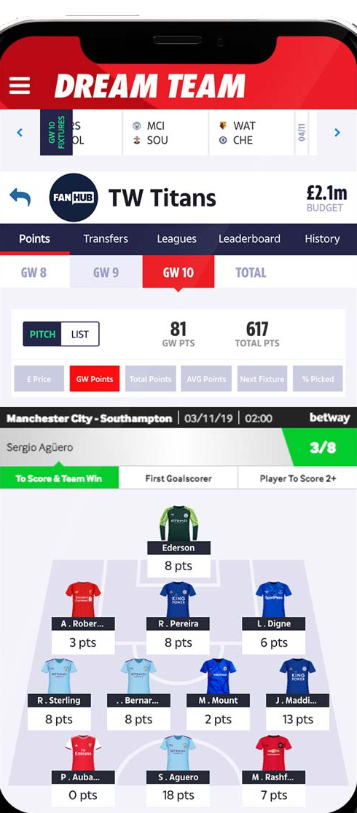
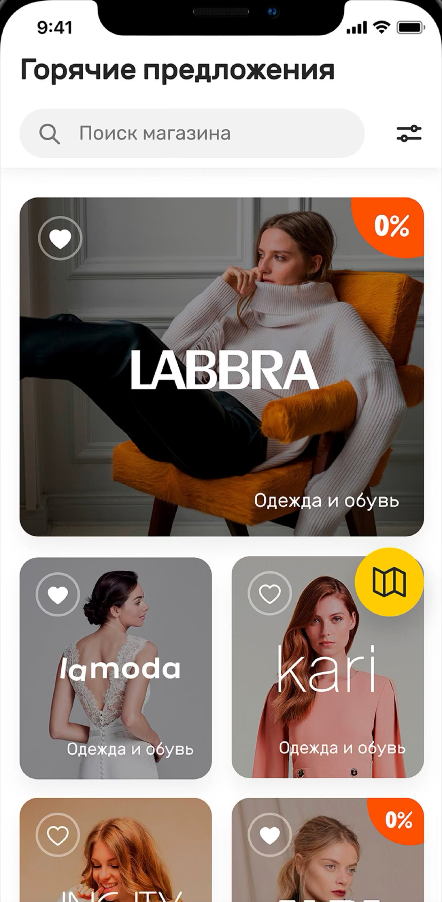

# **Ivan Zezyulya**
  

### **iOS Developer**
_Omsk, Russia_  

Links:

* GitHub: https://github.com/ivanzoid
* StackOverflow: https://stackoverflow.com/story/ivan_zezyulya
* LinkedIn: https://www.linkedin.com/in/ivanzezyulya/
* Telegram: http://t.me/ivanzoid
* VK: https://vk.com/ivanzoid
* Blog: http://zoid.cc
* CV (this one): https://github.com/ivanzoid/cv or https://ivanzoid.github.io/cv/

### **About**
12 years of software development (9 years in iOS).

I worked on numerous iOS projects, some successful (thousands and millions of users), some not so much. 

- Love good architecture and clear naming of things
- I prefer to not create complexity when it's not needed (but do it when it is)
- Like new technologies but prefer to wait when they become stable
- Can propose new features/solutions for business, estimate and write docs for them, implement, test and deploy
- Could lead a small team of developers (gathering information, preparing tasks, code review)
- Love automation (could it be CI/CD, or local scripts or code generation) when it saves time/resources
- Have backend development experience (Go/Python/PHP), which helps me to understand overall product architecture and communicate with backend team

### **Tech Stack**
- **iOS**:
  - Swift, Objective-C, MVVM
  - _System frameworks_: AVFoundation (video conversion/merging/cutting), AddressBook (contact list), AudioToolbox (low-level audio playback), AutoLayout, CFNetwork (low-level networking), CoreAnimation (/QuartzCore, advanced animations), CoreData, CoreGraphics (manual drawing), CoreLocation, CoreMotion (implementing AR before ARKit), CoreTelephony (determining cellular network type), EventKit (adding/reading events in calendar), Grand Central Dispatch, MapKit, Metal, Photos, Push Notifications, Security (interacting with Keychain), Social, SQLite, StoreKit (in-app purchases), UIKit, UIKit Dynamics, UserNotifications, WebKit, XCTest
  - _Libs/frameworks_: AWS SDK, Bugfender SDK, Firebase/Google Analytics, Google protobuf, Lottie, MagicalRecord, OpenAPI (Swagger), R.swift, Realm, RxSwift/RxCocoa, Quick/Nimble, Sentry API, SnapKit, SoundCloud API, SwiftLint, TestFlight, Youtube API
  - _CI_: Circle CI
  - _Automation_: CocoaPods, fastlane
- **Backend**: Golang, General Linux/Unix command-line experience, Ubuntu Server, Some Amazon AWS products (S3, EC2, DynamoDB, Redshift), PostgreSQL, MySQL, Python, PHP, bash, rsync, scp, screen, httpie, curl
- **DevOps**: Ansible
- **C++**: Qt, wxWidgets, STL
- **Python**: Python3, TCP sockets, Django

### **Employment history**
| Period | Description |
| - | - |
| Oct 2018 — Now | Senior iOS Developer at [Effective](https://effective.band/) |
| Nov 2016 — Jun 2018 | Senior iOS Developer at [Loud & Clear](https://loudclear.com.au) (acquired by [Avanade](https://www.avanade.com/)) |
| Oct 2015 — Aug 2016 | Senior iOS Developer at [AppsQuick.ly](http://appsquick.ly) |
| Jan 2015 — Oct 2015 | Software Architect (Mobile) at [Thumbtack Technology](https://thumbtack.ru)/[Lineate](https://www.lineate.com/) |
| Jun 2012 — Dec 2014 | Lead iOS Developer at [Al Digit](http://aldigit.com) |
| Jul 2011 — May 2012 | Senior iOS Developer at [Al Digit](http://aldigit.com) |
| Jun 2010 — Jun 2011 | iOS Developer at [Al Digit](http://aldigit.com) |
| May 2007 — May 2010 | Desktop apps developer at Freelance |
| Nov 2006 — Mar 2007 | Software developer at [ISS Art Ltd.](https://issart.com) |

### **Education**
| Period | Description |
| - | - |
| 2003 - 2007 | Institute of Information Technologies and Applied Mathematics, Omsk State University |
| 2000 - 2003 | Physics and Mathematics Lyceum 64, Omsk |

### **Work examples (apps)**

* #### **Vampr**
    

  _Social network for musicians._
  In [Best of 2017](https://web.archive.org/web/20180125053240/https://developer.apple.com/app-store/best-of-2017/trends-of-the-year/) app list by Apple.  
  3.5M+ connections as of Nov 2018.  
  https://vampr.me  
  https://apps.apple.com/app/vampr/id1069819177
  
  _Responsibilites_:
   - App architecture from ground up.
   - Developed most app parts.
   - Code review
   - Continuous Integration

  _Stack_: UIKit, UIKit Dynamics, MVC.

 

* #### **The Sun Dream Team FC**  
   

  _Fantasy football app for English Premier League._  
  500K users/month after launch.  
  https://www.dreamteamfc.com/c/  
  https://apps.apple.com/gb/app/dream-team-fantasy-football/id337710261  

  _Responsibilities_:
    * UI, Business logic and networking code
    * Implemented player field screen in 3D using UIKit.

  _Stack_: UIKit, VIPER, CoreData.  

 

* #### **iHerb**  
   

  _Mobile app for iHerb online store._  
  Participated in base stage of app development.  
  https://apps.apple.com/app/iherb/id636609212

  _Responsibilities_:
    - Base architecture
    - Home screen UI
    - Networking code.  
  
  _Stack_: UIKit, AFNetworking.

 

* #### **Interactive Display**  
  _iPad demo stand application for some retail networks in US._  
  _Responsibilities_:
    - Implementing new features
    - Unit tests.

  _Stack_: Swift, MVVM, Storyboards, iPad, Realm, GCD/NSOperationQueue, RxSwift.

 

- #### **Mokka**  
   

  _Finance service client._  
  https://apps.apple.com/app/id1499342014  

  _Responsibilities_:
    - Implementing features.
    - Code review
    - Unit tests

  _Stack_: Swift, MVVM, SnapKit, Repositories

 

- #### **Fernwood Fitness**
  _App for Australia’s largest female fitness network, Fernwood Fitness._  
  https://www.fernwoodfitness.com.au  
  https://apps.apple.com/au/app/fernwood/id1433822715  
  
  _Responsibilities_: UI, Business logic and networking code.  
  
  _Stack_: UIKit, OpenApi 3.0.

 

- #### **Fisho**
  _Social network for fishers in Australia._  
  https://www.fishoapp.com.au  

  _Responsibilities_: UI, Business logic and networking code. 

  _Stack_: UIKit, CorePlot, VIPER, OpenApi 2.0 (Swagger)

 

- #### **Momatu**
  _App for organizing memories._  
  https://apps.apple.com/us/app/momatu/id1313564080  

  _Responsibilities_: UI, Business logic and networking code. 

  _Stack_: UIKit, UIKit Dynamics.

 

- #### **StartFX**  
   

  _Trading terminal app._  
  https://apps.apple.com/us/app/startfx/id684181266  

  _Responsibilities_: 
    - developing all networking code
    - business logics for operations with deals (open/close/change)
    - part of UI.

  _Stack_: 
    - TCP sockets
    - UIKit
    - OpenGL (with custom shaders for graphs)
    - CoreData
    - GCD.

 

- #### **Nissan NI-PiK**
  _Application with cars' Gallery, Technical characteristics, List of colors, Compare to competitors, Register Client and other features for Nissan._  
  https://vimeo.com/43107303  

  _Responsibilities_: adding features to application, fixing bugs  

  _Stack_: UIKit, SOAP, JSON

 

- #### **OwlCity Galaxy**
  _OwlCity Galaxy is feature-rich promo application for UK band “Owl City”.  
  It included: 3D Galaxy View, Comment system, Embedded music player, Lyrics & images for songs, OwlCity Calendar, Videos, List of your friends, Customize your planet, Integrated fan store._  
  https://www.facebook.com/owlcity/posts/new-version-of-the-owl-city-galaxy-iphone-app-available-now-install-the-latest-u/203513706370561/  

  _Responsibilities_:
    - Main developer

  _Stack_: 
    - SIO2 (3D Engine for iPhone/Android)
    - XMPPFramework (XMPP/Jabber library for iOS)
    - Urban Airship (Push notifications)
    - ASIHttpRequest (networking)
    - Twitter API
    - Facebook SDK
    - Google Calendar API
    - Youtube API
    - Airbrake (error reporting)
    - SudzC (SOAP service wrappers generator)  

 

- #### **_Apartment search applications_**  
   

  _Series of applications (20+ apps) for real estate agencies in UK._  
  https://apps.apple.com/us/app/henry-adams/id377862665  

  _Responsibilities_: fixing bugs, improving application, adding features, implementing new applications for other agencies.

  _Stack_: UIKit, CoreLocation, XML, MapKit.  

  List of clients/applications developed: 
    - [Aspire](https://www.aspire.co.uk/)
    - [Bective Leslie March](https://bective.co.uk/)
    - [BELVOIR!](https://www.belvoir.co.uk/)
    - [Beresfords Estate Agents](https://www.beresfords.co.uk/)
    - [Chase Buchanan](https://www.chasebuchanan.london/)
    - [Colin Bibra](https://www.colinbibra.com)
    - [Gascoigne Halman](https://www.gascoignehalman.co.uk/)
    - [Henry Adams](https://apps.apple.com/us/app/henry-adams/id377862665)
    - [Icon Residential](https://iconresliving.com/)
    - [Lex Allan Estate Agents](https://lexallan.co.uk/)
    - [Life Residential](https://liferesidential.co.uk/)
    - [Living Residential Estate](https://www.livingresidential.com/)
    - [Manning Stainton](https://manningstainton.co.uk/)
    - [Michael Graham](https://michaelgraham.co.uk/)
    - [Morgan Randall](https://www.morganrandall.com/)
    - [Move Revolution](https://www.moverevolution.com/)
    - [Oliver's Town](https://oliverstown.com/)
    - [Parklane Properties](https://www.parklaneproperties.com/)
    - [The Property Lounge](http://www.thepropertylounge.co.uk/)
    - [Walkers Estate Agents](https://www.walkersestates.co.uk/)
    - [Waterfords](https://www.waterfords.co.uk/)
    - [Winchester Lettings](https://www.winchester-white.co.uk/)

 

- #### **Backend server for HAPOC game** 
  _HAPOC is online multiplayer casual game for guessing words by first letters._  
  https://apps.apple.com/us/app/hapoc-human-animal-plant-object/id497325725?mt=8  

  _Responsibilities_: develop from scratch server for iOS game Hapoc  

  _Stack_: Python 2.6, TCP sockets, Linux

 

- #### **Custody Connection**
  _Custody Connection is an easily viewable calendar, where parents can sync with each other to create, manage, trade days and view their custody schedule in one central location, anytime, anywhere they go with their iPhone, iTouch or iPad._  
  https://apps.apple.com/us/app/custody-connection/id472605882  

  _Responsibilities_: fixing bugs, adding new features  

  _Stack_: iOS: UIKit, CoreData, Calendar API; Server-side: C#, MS SQL Server

 

- #### **Hansel and Gretel**
  _Interactive book._  
  https://apps.apple.com/us/app/hansel-gretel-childrens-interactive/id396998808

  _Responsibilities_: main developer  
  _Stack_: UIKit

 

- #### **Apartment Rentals**
  _Find apartments, codos and houses for rent with the ApartmentRentals.com mobile app. Search for properties nearby, filter by price, bathrooms and bedrooms. See pictures and floor plans, and contact listings by phone or by submitting a form from within the app._  
  https://apps.apple.com/us/app/apartment-rentals/id588135302

  _Responsibilities_: Implement most of the application  
  _Stack_: UIKit, WebKit, CoreLocation
